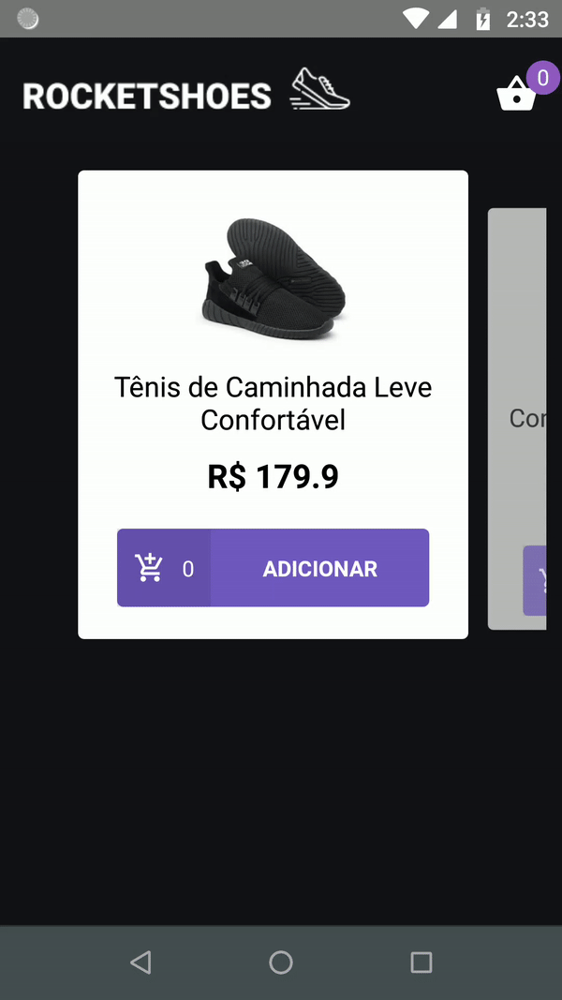

<h1 align="center">
  
</h1>

<h3 align="center">
:rocket: [Bootcamp GoStack#10] Desafio 07
</h3>

## Descrição
:cart: Desenvolver um e-commerce em React Native para venda de Calçados.

[Link da versão web](https://github.com/emanuelhfarias/bootcamp-gostack-modulo-07)  
[Link do desafio](https://github.com/Rocketseat/bootcamp-gostack-desafio-07/blob/66c10d7bc6d11c1c14f56ec2136e45aa32f9381d/README.md)  

### Resultado
<h1 align="center">
  
</h1>


### Subindo a aplicação
```sh
git clone ...
cd
yarn
react-native start
react-native run-android
adb reverse tcp:3333 tcp:3333
json-server server.json -p 3333 --watch --host 0.0.0.0
```

### Debugging with Reactotron
Open Reactotron, then run:
```sh
adb reverse tcp:9090 tcp:9090
```
Reload your app.
